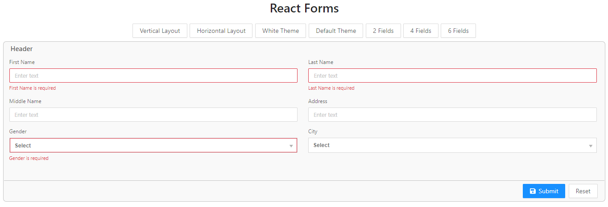
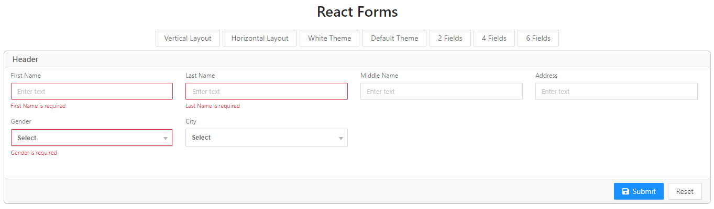
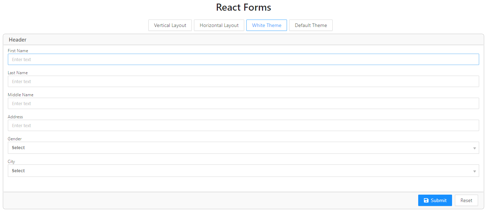

# react-forms

React Forms is a wrapper library around React Formik library and Yup validator with custom Form and Field implementation.
The purpose of this library to provide additional support for:

1. Layouts - Veritical and Horizantal
2. Themes - Default comes with two themes
3. Form handlers
   Handlers to provide form customization with methods like,

    - onInitializing - <em>Fires when Form is getting initilised</em>
    - onReady - <em>Fires when React Form DOM is ready</em>
    - onSubmitting - <em>Fires before submitting form</em>

4. Form Field Handler
    Handlers to provide form field customization with methods like,
    - getValues - <em>Fires when Form Field is getting initilised</em>
    - setValues - <em>Fires when onBlur event of Field</em>

## Form Section

Form Section is a powerful div container to create flexible, customizable layouts created using Css Flex. It is specifically desgined to create complex and nested UI layouts.

Configuration

- layout - <em>string, Default: FormSectionLayoutType.Vertical, Values: [FormSectionLayoutType.Vertical, FormSectionLayoutType.Horizantal]</em>
- theme - <em>string, Default: FormSectionTheme.Default, Values: [FormSectionTheme.Default, FormSectionTheme.White]</em>
- numberOfRowFields - <em>number, Default: 2, Values: [2,3,6], Specify number of form fields needs to show on horizantal layout</em>
- autoSpacing - <em>boolean, Default: false, Specify if want to have auto spacing between child elements, e.g. often we need auto spacing between button or sections</em>
- align - <em>string, Default: None, Values: [FormSectionAlignment.Left, FormSectionAlignment.Right]</em>
- width - <em>string, Default: auto</em>
- cssClasses - <em>string, Default: None, Specify custom css classes</em>
- style - <em>string, Default: None, Specify custom style</em>

## Form Query Parameter handler

This handler updates query string parameter on submit and update form values from query parameter values.

Configuration

- queryParams - <em>object, Form property name</em>
- fields - <em>Array, field names</em>
- allFields - <em>boolean, Default: false, Use if want to update use all fields</em>
- urlUpdate - <em>boolean, Default: true, Update Query Url</em>
- autoSubmit - <em>boolean, Default: false, Set true if want to Submit form On Form initilise</em>

## Form Field Cache handler

This handler caches form field values in local storage.
Configuration
    
- cache - <em>object, Form Field property name</em>
- provider - <em>string, Default: 'LocalStorage', provider name</em>
- max - <em>number, Default: 10, Specify how many field values to cache</em>

## Horizantal Layout

Configuration

- layout - <em>string, Default: FormSectionLayoutType.Horizontal, Form layout property name</em>
- numberOfRowFields - <em>number, Default: 2, Values: [2,3,6], Specify number of form fields needs to show on horizantal layout</em>

## Themes

Configuration

- default

- white

